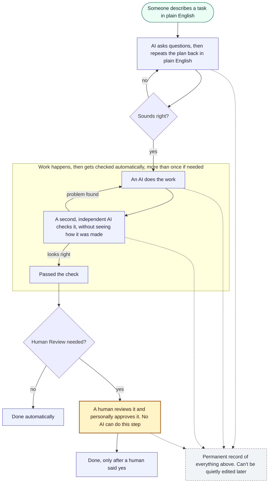
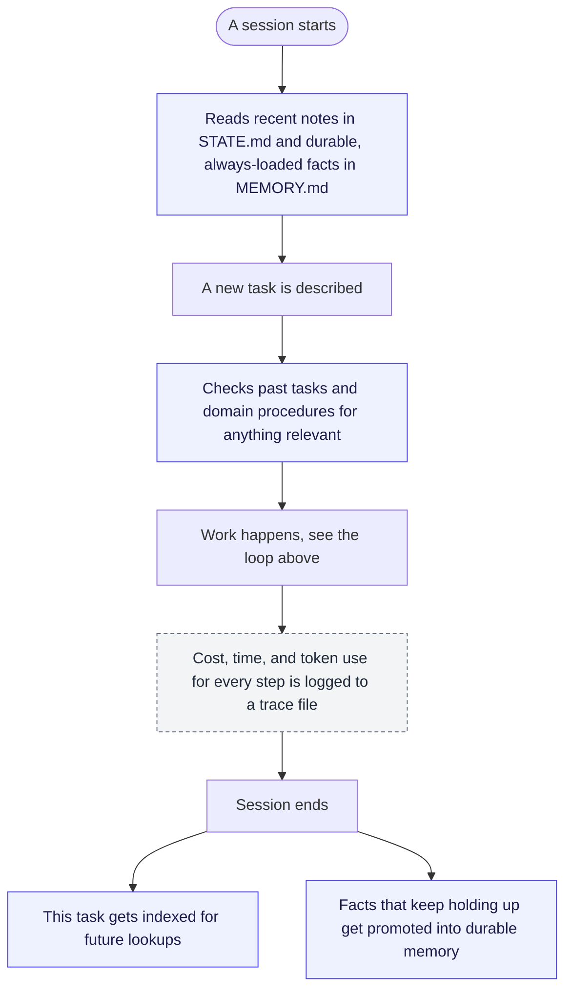

# RSK Intake

> The entire discipline of "harness engineering" is: push as much as possible into
> deterministic code at the boundaries where correctness actually matters, and only let the
> probabilistic part operate in the middle, fenced in on both sides.

This is a structure to implement a build-then-verify loop with a second, independent reviewer agent, human approval
gates, and stored memories for continuous improvement in agent behavior. Think of it like the gutters on a bowling lane: it doesn't do the work for you, it just keeps the ball from going somewhere it shouldn't.

Additionally, this repo includes a system for memory storage for continuous learning and improvement of the agent's behavior over time. The agent's actions are also logged in a traceability file so anything it does can be audited and understood in retrospect.

## Getting started

```
git clone https://github.com/amtamaddon/intake.git
cd intake
claude
```

Claude Code needs this folder as its session root, not a parent directory, since that's how
it discovers the custom agents and skills below. Once it's running, just describe what you
need.

## How it works



*Blue = AI acting on its own. Amber = a human must act. Grey = the permanent audit log
everything feeds into.*

1. **`/new-task`**: an interview, not a form. Describe what you need; Claude asks clarifying
   questions until it's confident it understood, then repeats its understanding back in plain
   English before writing anything. See [`.claude/skills/new-task/SKILL.md`](.claude/skills/new-task/SKILL.md).
2. **`/run-task <slug>`**: the loop shown above. A builder subagent produces the artifact,
   then a separate verifier subagent (fresh context, it never sees the builder's reasoning)
   grades it against a written rubric. A FAIL sends it back to the builder with the verdict's
   required fixes. Refuses to start at all if `goal.md` is incomplete
   (`scripts/check_goal.sh`), and stops, rather than looping forever, once the iteration
   budget runs out or two tries in a row make no real progress. Every action either subagent
   takes is written to `worklog.md`, the hash-chained audit trail, as it happens.
3. **Human approval, when it matters.** If the task's Impact class is `money` or
   `client-facing`, a human runs `scripts/approve.sh <task-dir>` themselves. No agent can
   write `APPROVAL.md`. That's denied at the permission level in `.claude/settings.json`, not
   just discouraged in a prompt.
4. **`/close-session`**: updates `STATE.md` with what was learned, prunes it back under its
   line cap, tracks which lessons have been confirmed enough times to become a reusable
   skill, and re-verifies the worklog's hash chain before considering the session closed.

## Memory & observability

RSK Intake gets better at its job over time and keeps a record of what it costs to run it:



- **`MEMORY.md`** — durable, always-loaded facts (environment quirks, rules that bite, domain
  constants), capped at 4,000 characters. Distinct from `STATE.md` (this session's residue,
  pruned aggressively) and `CLAUDE.md` (the constitution, changed by deliberate edit only).
  Written only via `scripts/memory_update.sh`.
- **`memory/episodes.db`** — a SQLite+FTS5 index over every past task, queried with
  `python scripts/recall.py`. It's a derived, rebuildable index, never a second source of
  truth: if it and the flat files under `tasks/` ever disagree, the flat files win.
- **`procedures/`** — domain fulfillment playbooks (payer denial codes, resubmission formats),
  looked up with `scripts/find_procedure.sh`. Starts at `status: draft`; a human has to
  approve one before a builder can find it through the sanctioned lookup path.
- **`trace.jsonl`** per task — token counts, latency, and computed cost per step, anchored
  into the hash-chained worklog with one entry rather than interleaved into it, so the
  low-volume decision narrative stays readable and the high-volume telemetry stays
  tamper-evident anyway.
- **`evals/`** — regression tests for the harness itself. A pre-commit hook blocks any change
  to `scripts/`, `.claude/`, `skills/`, or `templates/` if they fail.

## Example

```
> I have a batch of claim submissions from a provider. Pull out the CPT codes, the billed
> amount, and the payer ID for each, and flag anything that doesn't match our payer rules.
> Ask me if something's unclear.

Claude: A few questions first: what should the output look like, a spreadsheet, a summary
file, something else? ... Got it. Since this involves submitting to a payer, you'll approve
the result yourself before it's done. Here's what I understood: [plain-English summary]. Did
I get that right?

> yes

Claude: Set up. Ready when you are, say go and I'll run it.
```

The task's content above is illustrative; the mechanics (interview → confirmation → build →
verify → approval-if-needed) are exactly what the repo does.

## Guardrails

These aren't just described behaviors an AI might follow. Each one is enforced mechanically:

- **Incomplete tasks don't start.** `goal.md` needs a real End State, Verification Method,
  House Rules, and Stop Conditions, no placeholder text, before `/run-task` will spawn a
  builder at all.
- **No AI can approve its own work.** Writing `APPROVAL.md` is denied at the permission level
  in `.claude/settings.json`. A model can't be prompted around a permission it doesn't have.
- **Approval means a real person, by name.** `scripts/approve.sh` shows the reviewer's
  verdict, then asks for a typed name before writing anything. It's a guided version of
  editing the file yourself, not a shortcut around it.
- **History can't be quietly rewritten.** The worklog is append-only and hash-chained: every
  entry cites the hash of the one before it, so an edited or deleted entry breaks the chain,
  and `scripts/verify_worklog.sh` catches it.
- **Low-stakes work skips all of this, on purpose.** Internal-only, one session, no new PII,
  nothing leaving the machine: just do it and log one line in `tasks/quicklog.md`.

## Docs

| File | What it's for |
|---|---|
| [`CLAUDE.md`](CLAUDE.md) | The constitution: roles, model routing, house rules, session protocol, directory map |
| [`HOW-TO-ASK.md`](HOW-TO-ASK.md) | Plain-language guide for non-technical requesters |
| [`STATE.md`](STATE.md) | This session's working memory: verified facts, open failures, lessons learned |
| [`MEMORY.md`](MEMORY.md) | Durable, always-loaded operational memory, capped at 4,000 characters |
| `.claude/skills/` | Operator commands: `new-task`, `run-task`, `verify-task`, `close-session` |
| `skills/` | Harness-operational playbooks, promoted once a lesson is confirmed by two separate tasks |
| `procedures/` | Domain (RCM) fulfillment playbooks, human-approved before a builder can use one |
| `memory/` | The SQLite+FTS5 episodic index — derived, rebuildable, never authoritative |
| `evals/` | Regression suite for the harness itself; gates commits via a pre-commit hook |

## Layout

Full directory map lives in [`CLAUDE.md`](CLAUDE.md). This file stays focused on what RSK Intake
is and how to use it.
