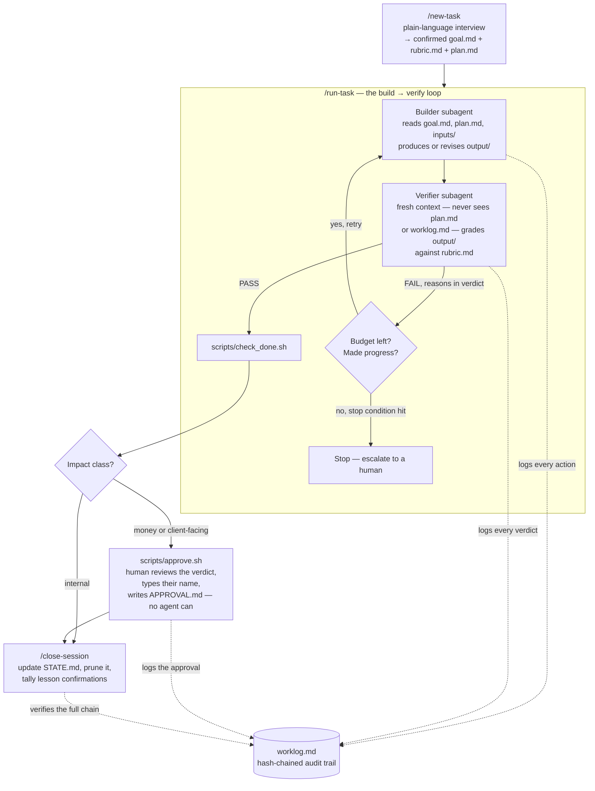

# Intake

AI agents handle the admin busywork. A human signs off on anything involving money or a
client — and nothing, not even the AI, can skip that step.

It's a compliance layer for AI doing admin work. Every step is logged in a way that can't be quietly edited afterward." If they push further: the business case is that it lets non-technical staff hand real work to AI without an engineer babysitting every request, while keeping a defensible audit trail if a client, auditor, or regulator ever asks "who approved this and why.

Handing admin work — money, client-facing communication, PII — to AI agents is risky without
structure: nothing checks the work, nothing remembers what went wrong last time, and nothing
stops an agent from declaring a mistake "done." Intake wraps every task in a plain-language
intake interview, a build-then-verify loop with a second, independent reviewer, and a human
approval gate that's enforced at the file-permission level, not by asking nicely. Think of it
like the gutters on a bowling lane: it doesn't do the work for you, it just keeps the ball from
going somewhere it shouldn't.

It's a compliance layer for AI doing admin work — nothing involving money or a client goes out the door without an independent check and a human's actual sign-off, and every step is logged in a way that can't be quietly edited afterward." If they push further: the business case is that it lets non-technical staff hand real work to AI without an engineer babysitting every request, while keeping a defensible audit trail if a client, auditor, or regulator ever asks "who approved this and why.

## How it works



1. **`/new-task`** — an interview, not a form. Describe what you need; Claude asks clarifying
   questions until it's confident it understood, then repeats its understanding back in plain
   English before writing anything. See [`.claude/skills/new-task/SKILL.md`](.claude/skills/new-task/SKILL.md).
2. **`/run-task <slug>`** — the loop shown above: a builder subagent produces the artifact, a
   separate verifier subagent (fresh context — it never sees the builder's reasoning) grades it
   against a written rubric, and a FAIL sends it back to the builder with the verdict's required
   fixes. Refuses to start at all if `goal.md` is incomplete (`scripts/check_goal.sh`), and stops
   — rather than looping forever — once the iteration budget runs out or two tries in a row make
   no real progress. Every action either subagent takes is written to `worklog.md`, the
   hash-chained audit trail, as it happens.
3. **Human approval, when it matters.** If the task's Impact class is `money` or
   `client-facing`, a human runs `scripts/approve.sh <task-dir>` themselves. No agent can write
   `APPROVAL.md` — it's denied at the permission level in `.claude/settings.json`, not just
   discouraged in a prompt.
4. **`/close-session`** — updates `STATE.md` with what was learned, prunes it back under its
   line cap, tracks which lessons have been confirmed enough times to become a reusable skill,
   and re-verifies the worklog's hash chain before considering the session closed.

## Example

```
> I have a client intake packet. Pull out the requester, the amount, and the due date, and
> flag anything that doesn't match our records. Don't contact the client — ask me if unsure.

Claude: A few questions first — what should the output look like: a summary file, a form,
something else? ... Got it. Since this involves a client, you'll approve the result yourself
before it's done. Here's what I understood: [plain-English summary]. Did I get that right?

> yes

Claude: Set up. Ready when you are — say go and I'll run it.
```

The task's content above is illustrative; the mechanics (interview → confirmation → build →
verify → approval-if-needed) are exactly what the repo does.

## Guardrails

- **Tasks refuse to start incomplete.** `goal.md` must have a real End State, Verification
  Method, House Rules, and Stop Conditions — no placeholder text — or `/run-task` won't spawn
  a builder at all.
- **No agent can write `APPROVAL.md`.** Enforced by deny rules in `.claude/settings.json`, not
  by convention — a model can't be prompted around a permission it doesn't have.
- **Approval requires a typed name**, via `scripts/approve.sh`, and shows the reviewer's verdict
  before asking. It's a guided version of editing the file yourself, not a shortcut around it.
- **The worklog is append-only and hash-chained.** Every entry cites the previous entry's hash;
  editing history after the fact breaks the chain and `scripts/verify_worklog.sh` catches it.
- **Low-stakes work skips all of this on purpose.** Internal-only, one-session, no new PII,
  nothing leaving the machine — just do it and log one line in `tasks/quicklog.md`.

## Docs

| File | What it's for |
|---|---|
| [`CLAUDE.md`](CLAUDE.md) | The constitution: roles, model routing, house rules, session protocol, directory map |
| [`HOW-TO-ASK.md`](HOW-TO-ASK.md) | Plain-language guide for non-technical requesters |
| [`STATE.md`](STATE.md) | Cross-session memory: verified facts, open failures, lessons learned |
| `.claude/skills/` | Operator commands — `new-task`, `run-task`, `verify-task`, `close-session` |
| `skills/` | Domain playbooks, promoted once a lesson is confirmed by two separate tasks |

## Layout

Full directory map lives in [`CLAUDE.md`](CLAUDE.md) — this file stays focused on what Intake is
and how to use it.
